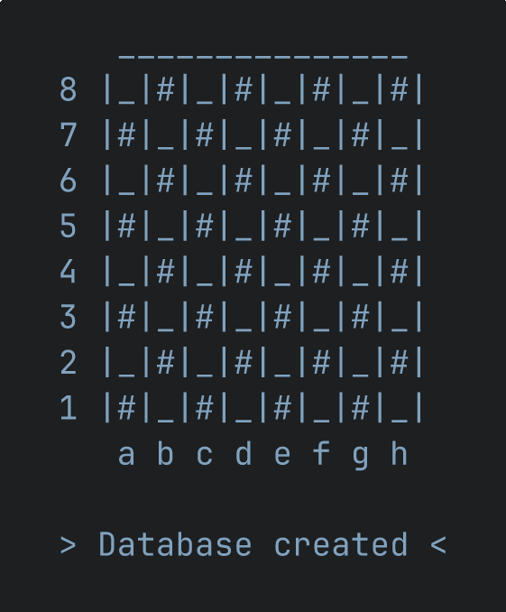

#  Puzzfinder DB

- 6M puzzles from [Lichess's open puzzle database](https://database.lichess.org/#puzzles)
- Single table, primary key on `puzzleId`, rows stored in `puzzleId` order
- 72 themes encoded as a `HUGEINT` bitmask — fast bitwise filtering
- Single-file (~800MB), single-process — no server required ([DuckDB](https://duckdb.org))



## Setup

```bash
docker compose run --rm init
```

Downloads the Lichess puzzle CSV, and imports it into DuckDB. Everything runs in Docker — no host DuckDB needed. Re-running only rebuilds when Lichess has published a newer file; use `docker compose run --rm -e FORCE=1 init` to rebuild anyway (e.g. after schema changes).

Stats and benchmarks run in the same image:

```bash
docker compose run --rm init ./stats/collect
docker compose run --rm init ./benchmarks/run
```

The deploy workflow runs daily and on relevant pushes to `main`, and can be triggered manually from the Actions tab.

## Schema

```sql
CREATE TABLE puzzles (
    puzzleId         TEXT  PRIMARY KEY,
    fen              TEXT     NOT NULL,
    moves            TEXT     NOT NULL,
    movesNumber      INTEGER  NOT NULL,
    rating           INTEGER  NOT NULL,
    ratingDeviation  INTEGER  NOT NULL,
    popularity       INTEGER  NOT NULL,
    nbPlays          INTEGER  NOT NULL,
    gameUrl          TEXT     NOT NULL,
    openingTags      TEXT,
    theme_mask       HUGEINT
);
```

## Themes

72 Lichess themes are stored as a bitmask in `theme_mask`. Each theme is assigned a fixed bit position (0–71), so a puzzle's themes are represented as a single `HUGEINT` where each set bit indicates the presence of that theme.

To filter by theme, you check that the relevant bits are all set:

```sql
-- puzzles tagged with both "fork" and "pin"
WHERE (theme_mask & ((1::HUGEINT << 29) | (1::HUGEINT << 55)))
    = ((1::HUGEINT << 29) | (1::HUGEINT << 55))
```

Use `themes/filter` to generate these expressions without looking up bit positions manually:

```bash
source themes/filter && theme_filter fork pin

# (theme_mask & ((1::HUGEINT << 29) | (1::HUGEINT << 55))) = ((1::HUGEINT << 29) | (1::HUGEINT << 55))
```

See [STATS.md](./STATS.md) for theme distribution across the database.

## Usage

```sql
-- Fork + pin puzzles, rating 1900–2100, sorted by popularity

SELECT puzzleId, fen, moves, rating
FROM puzzles
WHERE rating BETWEEN 1900 AND 2100
  AND (theme_mask & ((1::HUGEINT << 29) | (1::HUGEINT << 55))) = ((1::HUGEINT << 29) | (1::HUGEINT << 55))
ORDER BY popularity DESC
LIMIT 20;
```

## Performance

DuckDB uses the primary key ART index for `ORDER BY puzzleId` and can stop scanning once `LIMIT` is satisfied. Without an `ORDER BY`, it falls back to a full sequential scan of all 6M rows — so **always include `ORDER BY puzzleId`** unless you have a more meaningful sort.

For `COUNT(*)`, there's no early exit — it always scans every matching row.

There are no secondary indexes: DuckDB's ART indexes only serve point lookups, not range filters or sorts. Benchmarks with and without indexes on `rating`, `movesNumber`, `popularity` and `nbPlays` were identical, and dropping them shrinks the file from 1.09GB to 790MB.

See [BENCHMARKS.md](./BENCHMARKS.md) for measured query times.

## Recording

With [asciinema](https://asciinema.org) and [agg](https://github.com/asciinema/agg), in Tomorrow Night colors:

```bash
asciinema rec --cols 24 --rows 13 \
    -c "printf '\e[?25l'; bash -c '. utils/print_header && print_header Database created' | expand -t 2 | sed -z 's/\n//' | head -n -1" \
    preview.cast
agg --font-family "JetBrainsMonoNL Nerd Font Mono" --font-size 36 \
    --theme 1d1f21,c5c8c6,282a2e,cc6666,b5bd68,f0c674,81a2be,b294bb,8abeb7,c5c8c6,969896,cc6666,b5bd68,f0c674,81a2be,b294bb,8abeb7,ffffff \
    preview.cast preview.gif
# keep the last frame, crop the empty cursor row
ffmpeg -i preview.gif -update 1 -vf crop=iw:ih-27:0:0 preview.png
```
